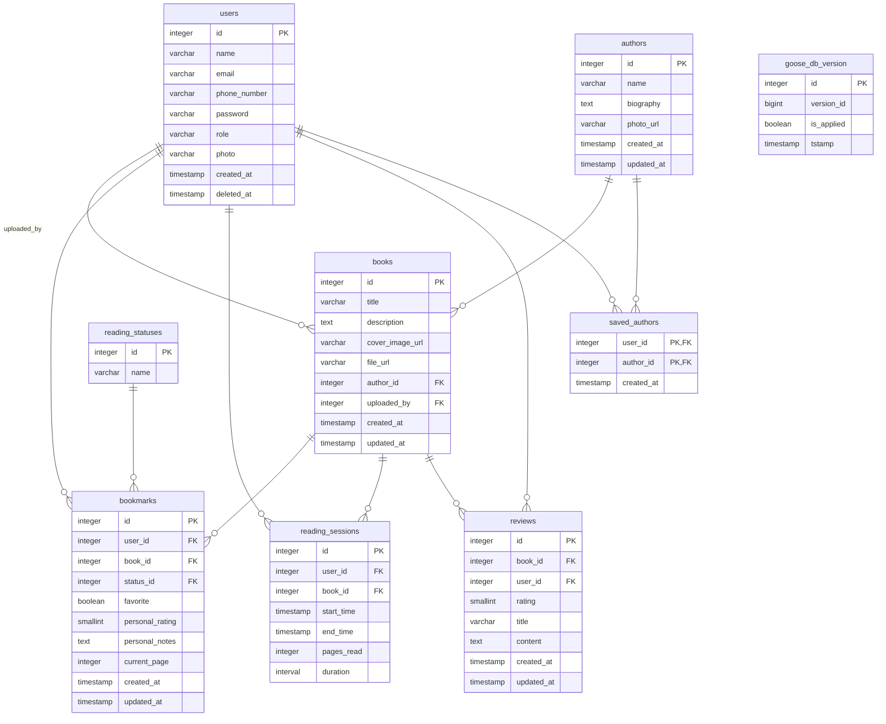

# 1. Описание проекта 
Nevermore — это проект по созданию веб-платформы, призванной преодолеть ключевую проблему современного цифрового чтения — фрагментацию опыта. Сегодня читатели вынуждены использовать несколько разрозненных сервисов: одно приложение для чтения электронных книг, другое — для ведения читательского дневника, третье (например, форум или социальная сеть) — для обсуждения прочитанного. Nevermore интегрирует все эти функции в единое, безопасное и интеллектуальное пространство, превращая чтение из уединенного занятия в насыщенный социальный и аналитический опыт.

Основные возможности и функции:

1. Удобный интерфейс для чтения с адаптацией под разные устройства.

2. Создание и участие в виртуальных книжных клубах.

3. Совместное комментирование, обсуждения, марафоны чтения.

4. Отслеживание времени чтения, количества прочитанных книг, целей, визуализация прогресса.

5. Регулярное обновление функционала на основе отзывов.

# 2. стек используемых технологий:

- **Фреймворки:** `Gin`
- **Слой данных:**
    - База данных: `PostgreSQL`
    - ORM: `goose`
    - Хранилище объектов: `AWS S3 (minIO)`
- **Авторизация:** `JWT Bearer`
- **Представление:**
    - Документация API: `OpenAPI (Swagger)`
    - Связь в реальном времени: `gorilla/websocket`
- **Контейнеризация:** `Docker`
- **Языки программирования:** `Go`, `SQL`
- **Инструменты и IDE:** `Goland`, `VS Code`, `postman`

# 3. Роли пользователей и  описание их действий в системе

# 4. Схема БД

# 5. API
Документация будет доступна по адресу: http://localhost:3000/docs/

# 6. Организация сетевого взаимодействия

1. Скачать любой VPN (например Proton VPN)
2. скачать ngrok
3. запустить VPN,
4. написать в ngrok ngrok http 3000
5. скомпилировать проект
6. передать полученную ссылку на фронт

