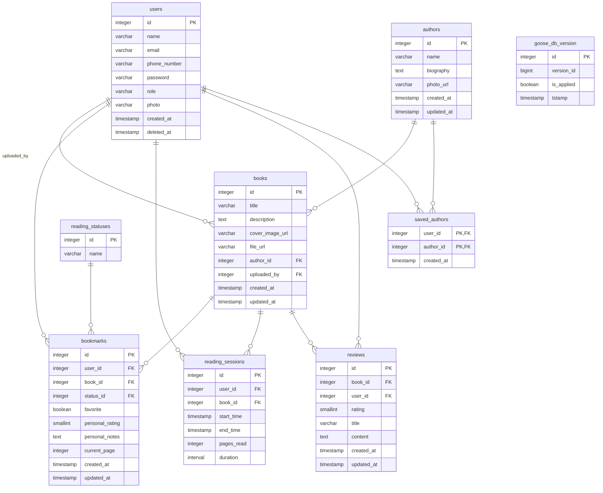

# 1. Описание проекта 
Nevermore — это проект по созданию веб-платформы, призванной преодолеть ключевую проблему современного цифрового чтения — фрагментацию опыта. Сегодня читатели вынуждены использовать несколько разрозненных сервисов: одно приложение для чтения электронных книг, другое — для ведения читательского дневника, третье (например, форум или социальная сеть) — для обсуждения прочитанного. Nevermore интегрирует все эти функции в единое, безопасное и интеллектуальное пространство, превращая чтение из уединенного занятия в насыщенный социальный и аналитический опыт.

Основные возможности и функции:

1. Удобный интерфейс для чтения с адаптацией под разные устройства.

2. Создание и участие в виртуальных книжных клубах.

3. Совместное комментирование, обсуждения, марафоны чтения.

4. Отслеживание времени чтения, количества прочитанных книг, целей, визуализация прогресса.

5. Регулярное обновление функционала на основе отзывов.

# 2. стек используемых технологий:

- **Фреймворки:** `Gin`
- **Слой данных:**
    - База данных: `PostgreSQL`
    - ORM: `goose`
    - Хранилище объектов: `AWS S3 (minIO)`
- **Авторизация:** `JWT Bearer`
- **Представление:**
    - Документация API: `OpenAPI (Swagger)`
    - Связь в реальном времени: `gorilla/websocket`
- **Контейнеризация:** `Docker`
- **Языки программирования:** `Go`, `SQL`
- **Инструменты и IDE:** `Goland`, `VS Code`, `postman`

# 3. Роли пользователей и  описание их действий в системе


# 4. Схема БД



```xml
<?xml version="1.0" encoding="UTF-8"?>
<mxfile host="app.diagrams.net" agent="Mozilla/5.0 (Windows NT 10.0; Win64; x64) AppleWebKit/537.36 (KHTML, like Gecko) Chrome/138.0.0.0 YaBrowser/25.8.0.0 Safari/537.36" version="28.2.5">
  <diagram name="Страница — 1" id="SuE3xcHiqi6o75nU4Rfg">
    <mxGraphModel dx="1821" dy="1725" grid="1" gridSize="10" guides="1" tooltips="1" connect="1" arrows="1" fold="1" page="1" pageScale="1" pageWidth="827" pageHeight="1169" math="0" shadow="0">
      <root>
        <mxCell id="0" />
        <mxCell id="1" parent="0" />
        <mxCell id="2cZ2AzJQLGmT9bRNQE28-1" value="&lt;p style=&quot;margin:0px;margin-top:4px;text-align:center;&quot;&gt;&lt;b&gt;authors&lt;/b&gt;&lt;/p&gt;&lt;hr size=&quot;1&quot;/&gt;&lt;p style=&quot;margin:0 0 0 4px;line-height:1.6;&quot;&gt; name: varchar(50)&lt;br/&gt; biography: text&lt;br/&gt; photo_url: varchar(255)&lt;br/&gt; created_at: timestamp with time zone&lt;br/&gt; updated_at: timestamp with time zone&lt;/p&gt;&lt;hr size=&quot;1&quot;/&gt;&lt;p style=&quot;margin:0 0 0 4px;line-height:1.6;&quot;&gt; id: integer&lt;/p&gt;" style="verticalAlign=top;align=left;overflow=fill;fontSize=14;fontFamily=Helvetica;html=1;rounded=0;shadow=0;comic=0;labelBackgroundColor=none;strokeWidth=1;" vertex="1" parent="1">
          <mxGeometry x="164" y="-140" width="272" height="184" as="geometry" />
        </mxCell>
        <mxCell id="2cZ2AzJQLGmT9bRNQE28-2" value="&lt;p style=&quot;margin:0px;margin-top:4px;text-align:center;&quot;&gt;&lt;b&gt;bookmarks&lt;/b&gt;&lt;/p&gt;&lt;hr size=&quot;1&quot;/&gt;&lt;p style=&quot;margin:0 0 0 4px;line-height:1.6;&quot;&gt; user_id: integer&lt;br/&gt; book_id: integer&lt;br/&gt; status_id: integer&lt;br/&gt; favorite: boolean&lt;br/&gt; personal_rating: smallint&lt;br/&gt; personal_notes: text&lt;br/&gt; current_page: integer&lt;br/&gt; created_at: timestamp with time zone&lt;br/&gt; updated_at: timestamp with time zone&lt;/p&gt;&lt;hr size=&quot;1&quot;/&gt;&lt;p style=&quot;margin:0 0 0 4px;line-height:1.6;&quot;&gt; id: integer&lt;/p&gt;" style="verticalAlign=top;align=left;overflow=fill;fontSize=14;fontFamily=Helvetica;html=1;rounded=0;shadow=0;comic=0;labelBackgroundColor=none;strokeWidth=1;" vertex="1" parent="1">
          <mxGeometry x="404" y="1172" width="272" height="280" as="geometry" />
        </mxCell>
        <mxCell id="2cZ2AzJQLGmT9bRNQE28-3" value="&lt;p style=&quot;margin:0px;margin-top:4px;text-align:center;&quot;&gt;&lt;b&gt;books&lt;/b&gt;&lt;/p&gt;&lt;hr size=&quot;1&quot;/&gt;&lt;p style=&quot;margin:0 0 0 4px;line-height:1.6;&quot;&gt; title: varchar(255)&lt;br/&gt; description: text&lt;br/&gt; cover_image_url: varchar(255)&lt;br/&gt; file_url: varchar(255)&lt;br/&gt; author_id: integer&lt;br/&gt; uploaded_by: integer&lt;br/&gt; created_at: timestamp with time zone&lt;br/&gt; updated_at: timestamp with time zone&lt;/p&gt;&lt;hr size=&quot;1&quot;/&gt;&lt;p style=&quot;margin:0 0 0 4px;line-height:1.6;&quot;&gt; id: integer&lt;/p&gt;" style="verticalAlign=top;align=left;overflow=fill;fontSize=14;fontFamily=Helvetica;html=1;rounded=0;shadow=0;comic=0;labelBackgroundColor=none;strokeWidth=1;" vertex="1" parent="1">
          <mxGeometry x="-136" y="564" width="272" height="256" as="geometry" />
        </mxCell>
        <mxCell id="2cZ2AzJQLGmT9bRNQE28-4" value="&lt;p style=&quot;margin:0px;margin-top:4px;text-align:center;&quot;&gt;&lt;b&gt;goose_db_version&lt;/b&gt;&lt;/p&gt;&lt;hr size=&quot;1&quot;/&gt;&lt;p style=&quot;margin:0 0 0 4px;line-height:1.6;&quot;&gt; version_id: bigint&lt;br/&gt; is_applied: boolean&lt;br/&gt; tstamp: timestamp&lt;/p&gt;&lt;hr size=&quot;1&quot;/&gt;&lt;p style=&quot;margin:0 0 0 4px;line-height:1.6;&quot;&gt; id: integer&lt;/p&gt;" style="verticalAlign=top;align=left;overflow=fill;fontSize=14;fontFamily=Helvetica;html=1;rounded=0;shadow=0;comic=0;labelBackgroundColor=none;strokeWidth=1;" vertex="1" parent="1">
          <mxGeometry x="368" y="124" width="184" height="147" as="geometry" />
        </mxCell>
        <mxCell id="2cZ2AzJQLGmT9bRNQE28-5" value="&lt;p style=&quot;margin:0px;margin-top:4px;text-align:center;&quot;&gt;&lt;b&gt;reading_sessions&lt;/b&gt;&lt;/p&gt;&lt;hr size=&quot;1&quot;/&gt;&lt;p style=&quot;margin:0 0 0 4px;line-height:1.6;&quot;&gt; user_id: integer&lt;br/&gt; book_id: integer&lt;br/&gt; start_time: timestamp with time zone&lt;br/&gt; end_time: timestamp with time zone&lt;br/&gt; pages_read: integer&lt;br/&gt; duration: interval&lt;/p&gt;&lt;hr size=&quot;1&quot;/&gt;&lt;p style=&quot;margin:0 0 0 4px;line-height:1.6;&quot;&gt; id: integer&lt;/p&gt;" style="verticalAlign=top;align=left;overflow=fill;fontSize=14;fontFamily=Helvetica;html=1;rounded=0;shadow=0;comic=0;labelBackgroundColor=none;strokeWidth=1;" vertex="1" parent="1">
          <mxGeometry x="-132" y="1208" width="265" height="208" as="geometry" />
        </mxCell>
        <mxCell id="2cZ2AzJQLGmT9bRNQE28-6" value="&lt;p style=&quot;margin:0px;margin-top:4px;text-align:center;&quot;&gt;&lt;b&gt;reading_statuses&lt;/b&gt;&lt;/p&gt;&lt;hr size=&quot;1&quot;/&gt;&lt;p style=&quot;margin:0 0 0 4px;line-height:1.6;&quot;&gt; name: varchar(50)&lt;/p&gt;&lt;hr size=&quot;1&quot;/&gt;&lt;p style=&quot;margin:0 0 0 4px;line-height:1.6;&quot;&gt; id: integer&lt;/p&gt;" style="verticalAlign=top;align=left;overflow=fill;fontSize=14;fontFamily=Helvetica;html=1;rounded=0;shadow=0;comic=0;labelBackgroundColor=none;strokeWidth=1;" vertex="1" parent="1">
          <mxGeometry x="492" y="648" width="177" height="95" as="geometry" />
        </mxCell>
        <mxCell id="2cZ2AzJQLGmT9bRNQE28-7" value="&lt;p style=&quot;margin:0px;margin-top:4px;text-align:center;&quot;&gt;&lt;b&gt;reviews&lt;/b&gt;&lt;/p&gt;&lt;hr size=&quot;1&quot;/&gt;&lt;p style=&quot;margin:0 0 0 4px;line-height:1.6;&quot;&gt; book_id: integer&lt;br/&gt; user_id: integer&lt;br/&gt; rating: smallint&lt;br/&gt; title: varchar(255)&lt;br/&gt; content: text&lt;br/&gt; created_at: timestamp with time zone&lt;br/&gt; updated_at: timestamp with time zone&lt;/p&gt;&lt;hr size=&quot;1&quot;/&gt;&lt;p style=&quot;margin:0 0 0 4px;line-height:1.6;&quot;&gt; id: integer&lt;/p&gt;" style="verticalAlign=top;align=left;overflow=fill;fontSize=14;fontFamily=Helvetica;html=1;rounded=0;shadow=0;comic=0;labelBackgroundColor=none;strokeWidth=1;" vertex="1" parent="1">
          <mxGeometry x="84" y="916" width="272" height="232" as="geometry" />
        </mxCell>
        <mxCell id="2cZ2AzJQLGmT9bRNQE28-8" value="&lt;p style=&quot;margin:0px;margin-top:4px;text-align:center;&quot;&gt;&lt;b&gt;saved_authors&lt;/b&gt;&lt;/p&gt;&lt;hr size=&quot;1&quot;/&gt;&lt;p style=&quot;margin:0 0 0 4px;line-height:1.6;&quot;&gt; created_at: timestamp with time zone&lt;/p&gt;&lt;hr size=&quot;1&quot;/&gt;&lt;p style=&quot;margin:0 0 0 4px;line-height:1.6;&quot;&gt; user_id: integer&lt;br/&gt; author_id: integer&lt;/p&gt;" style="verticalAlign=top;align=left;overflow=fill;fontSize=14;fontFamily=Helvetica;html=1;rounded=0;shadow=0;comic=0;labelBackgroundColor=none;strokeWidth=1;" vertex="1" parent="1">
          <mxGeometry x="86" y="416" width="268" height="121" as="geometry" />
        </mxCell>
        <mxCell id="2cZ2AzJQLGmT9bRNQE28-9" value="&lt;p style=&quot;margin:0px;margin-top:4px;text-align:center;&quot;&gt;&lt;b&gt;users&lt;/b&gt;&lt;/p&gt;&lt;hr size=&quot;1&quot;/&gt;&lt;p style=&quot;margin:0 0 0 4px;line-height:1.6;&quot;&gt; name: varchar(50)&lt;br/&gt; email: varchar(129)&lt;br/&gt; phone_number: varchar(15)&lt;br/&gt; password: varchar(255)&lt;br/&gt; role: varchar(20)&lt;br/&gt; photo: varchar(255)&lt;br/&gt; created_at: timestamp with time zone&lt;br/&gt; deleted_at: timestamp with time zone&lt;/p&gt;&lt;hr size=&quot;1&quot;/&gt;&lt;p style=&quot;margin:0 0 0 4px;line-height:1.6;&quot;&gt; id: integer&lt;/p&gt;" style="verticalAlign=top;align=left;overflow=fill;fontSize=14;fontFamily=Helvetica;html=1;rounded=0;shadow=0;comic=0;labelBackgroundColor=none;strokeWidth=1;" vertex="1" parent="1">
          <mxGeometry x="-134" y="64" width="268" height="256" as="geometry" />
        </mxCell>
        <mxCell id="2cZ2AzJQLGmT9bRNQE28-10" value="" style="html=1;rounded=1;edgeStyle=orthogonalEdgeStyle;dashed=0;startArrow=none;endArrow=block;endSize=12;strokeColor=#595959;exitX=0.167;exitY=0.000;exitDx=0;exitDy=0;entryX=0.500;entryY=1.000;entryDx=0;entryDy=0;" edge="1" parent="1" source="2cZ2AzJQLGmT9bRNQE28-2" target="2cZ2AzJQLGmT9bRNQE28-3">
          <mxGeometry width="50" height="50" relative="1" as="geometry">
            <Array as="points">
              <mxPoint x="449" y="892" />
              <mxPoint y="892" />
            </Array>
          </mxGeometry>
        </mxCell>
        <mxCell id="2cZ2AzJQLGmT9bRNQE28-11" value="book_id:id" style="edgeLabel;resizable=0;html=1;align=left;verticalAlign=top;strokeColor=default;" vertex="1" connectable="0" parent="2cZ2AzJQLGmT9bRNQE28-10">
          <mxGeometry x="194" y="872" as="geometry" />
        </mxCell>
        <mxCell id="2cZ2AzJQLGmT9bRNQE28-12" value="" style="html=1;rounded=1;edgeStyle=orthogonalEdgeStyle;dashed=0;startArrow=none;endArrow=block;endSize=12;strokeColor=#595959;exitX=0.833;exitY=0.000;exitDx=0;exitDy=0;entryX=0.500;entryY=1.000;entryDx=0;entryDy=0;" edge="1" parent="1" source="2cZ2AzJQLGmT9bRNQE28-2" target="2cZ2AzJQLGmT9bRNQE28-6">
          <mxGeometry width="50" height="50" relative="1" as="geometry">
            <Array as="points">
              <mxPoint x="631" y="1152" />
              <mxPoint x="580" y="1152" />
            </Array>
          </mxGeometry>
        </mxCell>
        <mxCell id="2cZ2AzJQLGmT9bRNQE28-13" value="status_id:id" style="edgeLabel;resizable=0;html=1;align=left;verticalAlign=top;strokeColor=default;" vertex="1" connectable="0" parent="2cZ2AzJQLGmT9bRNQE28-12">
          <mxGeometry x="563" y="1152" as="geometry" />
        </mxCell>
        <mxCell id="2cZ2AzJQLGmT9bRNQE28-14" value="" style="html=1;rounded=1;edgeStyle=orthogonalEdgeStyle;dashed=0;startArrow=none;endArrow=block;endSize=12;strokeColor=#595959;exitX=0.500;exitY=0.000;exitDx=0;exitDy=0;entryX=0.750;entryY=1.000;entryDx=0;entryDy=0;" edge="1" parent="1" source="2cZ2AzJQLGmT9bRNQE28-2" target="2cZ2AzJQLGmT9bRNQE28-9">
          <mxGeometry width="50" height="50" relative="1" as="geometry">
            <Array as="points">
              <mxPoint x="540" y="1152" />
              <mxPoint x="460" y="1152" />
              <mxPoint x="460" y="392" />
              <mxPoint x="380" y="392" />
              <mxPoint x="380" y="352" />
              <mxPoint x="67" y="352" />
            </Array>
          </mxGeometry>
        </mxCell>
        <mxCell id="2cZ2AzJQLGmT9bRNQE28-15" value="user_id:id" style="edgeLabel;resizable=0;html=1;align=left;verticalAlign=top;strokeColor=default;" vertex="1" connectable="0" parent="2cZ2AzJQLGmT9bRNQE28-14">
          <mxGeometry x="401" y="572" as="geometry" />
        </mxCell>
        <mxCell id="2cZ2AzJQLGmT9bRNQE28-16" value="" style="html=1;rounded=1;edgeStyle=orthogonalEdgeStyle;dashed=0;startArrow=none;endArrow=block;endSize=12;strokeColor=#595959;exitX=0.750;exitY=0.000;exitDx=0;exitDy=0;entryX=0.500;entryY=1.000;entryDx=0;entryDy=0;" edge="1" parent="1" source="2cZ2AzJQLGmT9bRNQE28-3" target="2cZ2AzJQLGmT9bRNQE28-1">
          <mxGeometry width="50" height="50" relative="1" as="geometry">
            <Array as="points">
              <mxPoint x="68" y="392" />
              <mxPoint x="60" y="392" />
              <mxPoint x="60" y="372" />
              <mxPoint x="300" y="372" />
            </Array>
          </mxGeometry>
        </mxCell>
        <mxCell id="2cZ2AzJQLGmT9bRNQE28-17" value="author_id:id" style="edgeLabel;resizable=0;html=1;align=left;verticalAlign=top;strokeColor=default;" vertex="1" connectable="0" parent="2cZ2AzJQLGmT9bRNQE28-16">
          <mxGeometry x="-1" y="411" as="geometry" />
        </mxCell>
        <mxCell id="2cZ2AzJQLGmT9bRNQE28-18" value="" style="html=1;rounded=1;edgeStyle=orthogonalEdgeStyle;dashed=0;startArrow=none;endArrow=block;endSize=12;strokeColor=#595959;exitX=0.250;exitY=0.000;exitDx=0;exitDy=0;entryX=0.250;entryY=1.000;entryDx=0;entryDy=0;" edge="1" parent="1" source="2cZ2AzJQLGmT9bRNQE28-3" target="2cZ2AzJQLGmT9bRNQE28-9">
          <mxGeometry width="50" height="50" relative="1" as="geometry">
            <Array as="points">
              <mxPoint x="-68" y="532" />
              <mxPoint x="-67" y="532" />
            </Array>
          </mxGeometry>
        </mxCell>
        <mxCell id="2cZ2AzJQLGmT9bRNQE28-19" value="uploaded_by:id" style="edgeLabel;resizable=0;html=1;align=left;verticalAlign=top;strokeColor=default;" vertex="1" connectable="0" parent="2cZ2AzJQLGmT9bRNQE28-18">
          <mxGeometry x="-156" y="522" as="geometry" />
        </mxCell>
        <mxCell id="2cZ2AzJQLGmT9bRNQE28-20" value="" style="html=1;rounded=1;edgeStyle=orthogonalEdgeStyle;dashed=0;startArrow=none;endArrow=block;endSize=12;strokeColor=#595959;exitX=0.250;exitY=0.000;exitDx=0;exitDy=0;entryX=0.500;entryY=1.000;entryDx=0;entryDy=0;" edge="1" parent="1" source="2cZ2AzJQLGmT9bRNQE28-5" target="2cZ2AzJQLGmT9bRNQE28-3">
          <mxGeometry width="50" height="50" relative="1" as="geometry">
            <Array as="points">
              <mxPoint x="-66" y="892" />
              <mxPoint y="892" />
            </Array>
          </mxGeometry>
        </mxCell>
        <mxCell id="2cZ2AzJQLGmT9bRNQE28-21" value="book_id:id" style="edgeLabel;resizable=0;html=1;align=left;verticalAlign=top;strokeColor=default;" vertex="1" connectable="0" parent="2cZ2AzJQLGmT9bRNQE28-20">
          <mxGeometry x="-127" y="914" as="geometry" />
        </mxCell>
        <mxCell id="2cZ2AzJQLGmT9bRNQE28-22" value="" style="html=1;rounded=1;edgeStyle=orthogonalEdgeStyle;dashed=0;startArrow=none;endArrow=block;endSize=12;strokeColor=#595959;exitX=0.750;exitY=0.000;exitDx=0;exitDy=0;entryX=0.750;entryY=1.000;entryDx=0;entryDy=0;" edge="1" parent="1" source="2cZ2AzJQLGmT9bRNQE28-5" target="2cZ2AzJQLGmT9bRNQE28-9">
          <mxGeometry width="50" height="50" relative="1" as="geometry">
            <Array as="points">
              <mxPoint x="66" y="852" />
              <mxPoint x="380" y="852" />
              <mxPoint x="380" y="352" />
              <mxPoint x="67" y="352" />
            </Array>
          </mxGeometry>
        </mxCell>
        <mxCell id="2cZ2AzJQLGmT9bRNQE28-23" value="user_id:id" style="edgeLabel;resizable=0;html=1;align=left;verticalAlign=top;strokeColor=default;" vertex="1" connectable="0" parent="2cZ2AzJQLGmT9bRNQE28-22">
          <mxGeometry x="321" y="592" as="geometry" />
        </mxCell>
        <mxCell id="2cZ2AzJQLGmT9bRNQE28-24" value="" style="html=1;rounded=1;edgeStyle=orthogonalEdgeStyle;dashed=0;startArrow=none;endArrow=block;endSize=12;strokeColor=#595959;exitX=0.250;exitY=0.000;exitDx=0;exitDy=0;entryX=0.500;entryY=1.000;entryDx=0;entryDy=0;" edge="1" parent="1" source="2cZ2AzJQLGmT9bRNQE28-7" target="2cZ2AzJQLGmT9bRNQE28-3">
          <mxGeometry width="50" height="50" relative="1" as="geometry">
            <Array as="points">
              <mxPoint x="152" y="892" />
              <mxPoint y="892" />
            </Array>
          </mxGeometry>
        </mxCell>
        <mxCell id="2cZ2AzJQLGmT9bRNQE28-25" value="book_id:id" style="edgeLabel;resizable=0;html=1;align=left;verticalAlign=top;strokeColor=default;" vertex="1" connectable="0" parent="2cZ2AzJQLGmT9bRNQE28-24">
          <mxGeometry x="46" y="872" as="geometry" />
        </mxCell>
        <mxCell id="2cZ2AzJQLGmT9bRNQE28-26" value="" style="html=1;rounded=1;edgeStyle=orthogonalEdgeStyle;dashed=0;startArrow=none;endArrow=block;endSize=12;strokeColor=#595959;exitX=0.750;exitY=0.000;exitDx=0;exitDy=0;entryX=0.750;entryY=1.000;entryDx=0;entryDy=0;" edge="1" parent="1" source="2cZ2AzJQLGmT9bRNQE28-7" target="2cZ2AzJQLGmT9bRNQE28-9">
          <mxGeometry width="50" height="50" relative="1" as="geometry">
            <Array as="points">
              <mxPoint x="288" y="872" />
              <mxPoint x="420" y="872" />
              <mxPoint x="420" y="392" />
              <mxPoint x="380" y="392" />
              <mxPoint x="380" y="352" />
              <mxPoint x="67" y="352" />
            </Array>
          </mxGeometry>
        </mxCell>
        <mxCell id="2cZ2AzJQLGmT9bRNQE28-27" value="user_id:id" style="edgeLabel;resizable=0;html=1;align=left;verticalAlign=top;strokeColor=default;" vertex="1" connectable="0" parent="2cZ2AzJQLGmT9bRNQE28-26">
          <mxGeometry x="391" y="372" as="geometry" />
        </mxCell>
        <mxCell id="2cZ2AzJQLGmT9bRNQE28-28" value="" style="html=1;rounded=1;edgeStyle=orthogonalEdgeStyle;dashed=0;startArrow=none;endArrow=block;endSize=12;strokeColor=#595959;exitX=0.250;exitY=0.000;exitDx=0;exitDy=0;entryX=0.500;entryY=1.000;entryDx=0;entryDy=0;" edge="1" parent="1" source="2cZ2AzJQLGmT9bRNQE28-8" target="2cZ2AzJQLGmT9bRNQE28-1">
          <mxGeometry width="50" height="50" relative="1" as="geometry">
            <Array as="points">
              <mxPoint x="153" y="392" />
              <mxPoint x="60" y="392" />
              <mxPoint x="60" y="372" />
              <mxPoint x="300" y="372" />
            </Array>
          </mxGeometry>
        </mxCell>
        <mxCell id="2cZ2AzJQLGmT9bRNQE28-29" value="author_id:id" style="edgeLabel;resizable=0;html=1;align=left;verticalAlign=top;strokeColor=default;" vertex="1" connectable="0" parent="2cZ2AzJQLGmT9bRNQE28-28">
          <mxGeometry x="84" y="382" as="geometry" />
        </mxCell>
        <mxCell id="2cZ2AzJQLGmT9bRNQE28-30" value="" style="html=1;rounded=1;edgeStyle=orthogonalEdgeStyle;dashed=0;startArrow=none;endArrow=block;endSize=12;strokeColor=#595959;exitX=0.750;exitY=0.000;exitDx=0;exitDy=0;entryX=0.750;entryY=1.000;entryDx=0;entryDy=0;" edge="1" parent="1" source="2cZ2AzJQLGmT9bRNQE28-8" target="2cZ2AzJQLGmT9bRNQE28-9">
          <mxGeometry width="50" height="50" relative="1" as="geometry">
            <Array as="points">
              <mxPoint x="287" y="392" />
              <mxPoint x="380" y="392" />
              <mxPoint x="380" y="352" />
              <mxPoint x="67" y="352" />
            </Array>
          </mxGeometry>
        </mxCell>
        <mxCell id="2cZ2AzJQLGmT9bRNQE28-31" value="user_id:id" style="edgeLabel;resizable=0;html=1;align=left;verticalAlign=top;strokeColor=default;" vertex="1" connectable="0" parent="2cZ2AzJQLGmT9bRNQE28-30">
          <mxGeometry x="321" y="362" as="geometry" />
        </mxCell>
      </root>
    </mxGraphModel>
  </diagram>
</mxfile>

```

# 5. API
Документация будет доступна по адресу: http://localhost:3000/docs/


